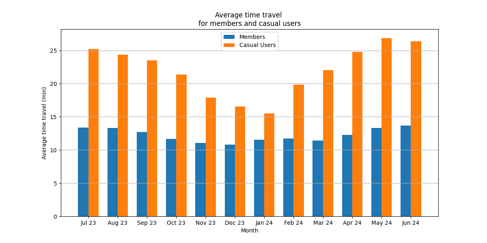
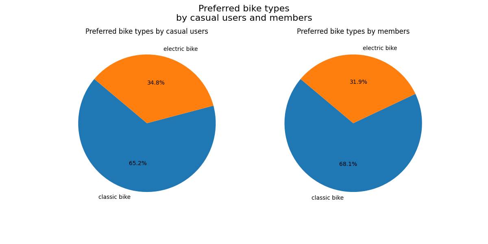
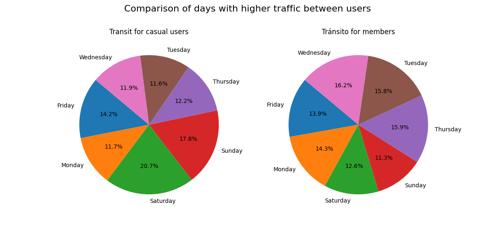

<!-- Diapositiva 1 -->

  <h1>Comparative Analysis of Bicycle Usage between Annual Members and Casual Users of Cyclistic</h1>
  <h2>A project to understand the differences in usage behavior between casual users and members of Cyclistic's bicycle-sharing service.</h2>
  
<strong>This project is part of the final project for the Google Data Analytics certification.</strong>

   
  

    <a href="https://drive.google.com/file/d/13EYPsDEqjUWsiyIqbHQ4sbqPr4mTnljz/view?usp=sharing" style="font-size: 18px; text-decoration: none;">📥 Download Project</a> |
    <a href="https://divvybikes.com/data-license-agreement" style="font-size: 18px; text-decoration: none;">📊 Data License</a>
  

<!-- Diapositiva 2 -->

  <h2>🔍 Problem</h2>
  
Cyclistic is a bike share company in Chicago. Cyclistic's annual members generate significantly higher revenue compared to casual users. To drive future growth, increasing the number of annual subscribers is essential. A marketing strategy is needed to convert casual users into annual members. Understanding the differences in usage behavior between these two groups is crucial for achieving this goal.
 
  <h2>✅ Solution</h2>  
  
Propose at least three recommendations based on the findings that help to design a marketing strategy.

<!-- Diapositiva 3 -->

  <h2>Analytical Goals</h2>
  <ul>
    <ul><strong>What</strong> distinguishes annual members from casual users?</ul>
    <ul><strong>Why</strong> casual users would purchase annual memberships.</ul>
  </ul>

<!-- Diapositiva 4 -->

  <h2> Time Travel Trend for Members and Casual Users</h2>
  

    <!-- Imagen -->
    
    
The average trip duration for casual users decreases each month during the second half of 2023 and starts to increase again each month in the first half of 2024. This trend is slightly noticeable for members, but not significantly.

  

<!-- Diapositiva 5 -->

  <h2> Preferred Bike Types Among Users</h2>
  

    <!-- Imagen -->
    
    
Both members and casual users mostly prefer classic bikes over electric ones. However, casual users use electric bikes more frequently (34.1% of trips) compared to members (31.9%).

  

<!-- Diapositiva 6 -->

  <h2> Users Traffic by Days</h2>
  

    <!-- Imagen -->
    
    
Casual users show higher traffic on weekends, whereas members have lower weekend traffic but more evenly distributed usage throughout the week.

  

<!-- Diapositiva 7 -->

  <!-- Conclusiones -->
  

    <h3>Conclusions</h3>
    
Members use bikes almost daily with consistent usage year-round, while casual users decrease in winter.

  

  
  <!-- Recomendaciones -->
  

    <h3>Recommendations</h3>
      <ul><strong>Offer Incentives:</strong> Implement reduced rates or allow membership freezes at no extra cost.</ul>
      <ul><strong>Share Member Stories:</strong> Promote testimonials from year-round bike users.</ul>
      <ul><strong>Promote Electric Bikes:</strong> Highlight the benefits of electric bikes.</ul>
  

